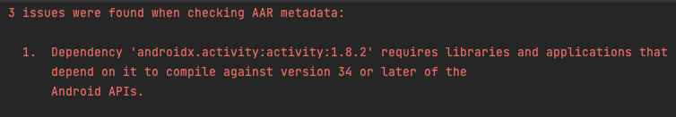
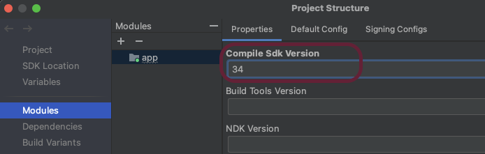

# FAQ

## 컴파일 SDK 버전 오류 케이스
아래와 같은 오류가 생길 경우에는,



Project structure 윈도우를 열고, Modules 탭을 선택합니다.
그리고, Compile Sdk Version을 알맞게 수정하여 줍니다.



## 속성 업데이트가 안 되는 케이스
아래와 같이 매번 getMediaPlayer()를 사용하여 미디어 플레이어를 불러와서 속성을 업데이트 하는 경우에, 몇몇 속성들이 업데이트 되지 않는 경우가 있습니다.

```kotlin
Button(
    onClick = { 
        getMediaPlayer {
            it.muted = !it.muted	// 토글이 되지 않음
        }
    }
) {
    Text("Toggle mute")
}
```

매번 getMediaPlayer()를 사용하는 것이 아니라, 아래처럼 사용하시면 됩니다. 물론, 비동기로 미디어 플레이어를 가지고 온다는 사실은 잊지마세요.

```kotlin
val mediaPlayer: MediaPlayer? = null 

getMediaPlayer {
    mediaPlayer = it
} 

Button(
    onClick = { 
        val mediaPlayer = mediaPlayer ?: return
        mediaPlayer.muted = !mediaPlayer.muted	// 토글이 잘 됨
    }
) {
    Text("Toggle mute")
}
```
