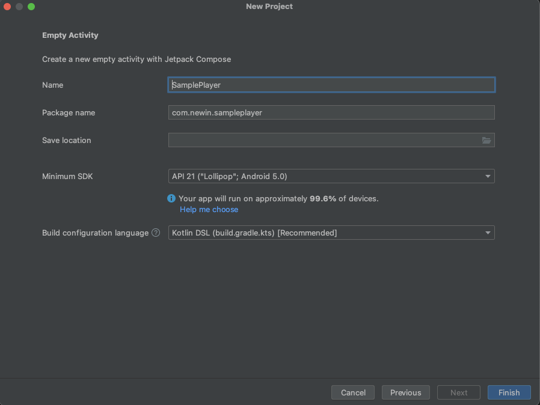

# 프로젝트 생성

## 빈 프로젝트 생성

File > New > New Project 를 선택하여, 빈 프로젝트를 생성합니다.

## 액티비티 선택

템플릿을 참고하여 사용하고자 하는 액티비티를 선택합니다.

## 프로젝트 설정 및 생성

Name, Package name, Save location, Minimum SDK 및 Build configuration language를 설정하고, Finish 버튼을 눌러 프로젝트를 생성합니다.

