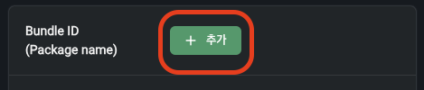

# 사용 방법

## 패키지 이름 추가

콘솔에 로그인하고 설정 > 애플리케이션으로 이동합니다.


아래 Bundle ID (Package name) 섹션에서 추가 버튼을 클릭합니다.



패키지 이름을 **추가**합니다.


패키지 이름은 build.gradle.kts 파일 내의 applicationId에서 찾을 수 있습니다.

```kotlin
android {
    defaultConfig {
        applicationId = "com.nplayersdk.sample" // 패키지 이름
    }
}
```

## 액티비티 구성

먼저 startMediaPlayerService를 호출하여 서비스를 시작합니다. 여기서 플레이어와 미디어세션을 만들고 DRM 기본 설정을 합니다.

```kotlin
import android.os.Bundle
import androidx.activity.ComponentActivity
import androidx.media3.common.MediaItem
import com.newin.nplayer.sdk.extensions.presentMediaPlayer
import com.newin.nplayer.sdk.extensions.startMediaPlayerService
import com.newin.nplayer.sdk.withDrmConfiguration

class MainActivity : ComponentActivity() {
	override fun onCreate(savedInstanceState: Bundle?) {
		super.onCreate(savedInstanceState)

        startMediaPlayerService("xxxxxxxx-xxxx-xxxx-xxxx-xxxxxxxxxxx") // App 아이디
	}
}
```

App 아이디는 콘솔에서 설정 > 애플리케이션 > App ID > 보기를 클릭하여 확인 가능합니다. 복사하여 붙여넣기를 하실 수 있습니다.


### 미디어 아이템 구성 예제 

아래처럼, 미디어 아이템을 구성하고 열 수 있습니다.

```kotlin
import androidx.media3.common.MediaItem
import com.newin.nplayer.sdk.MediaPlayerActivityConfiguration
import com.newin.nplayer.sdk.extensions.presentMediaPlayer
import com.newin.nplayer.sdk.extensions.withDrmConfiguration

Button(
	onClick = { 
		// uri를 입력 받아서 아이템을 만듭니다. 이때, 반드시 DRM 설정을 합니다.
		val mediaItem = MediaItem.fromUri("https://example.com/media.mp4")
			.withDrmConfiguration(
				appId = "xxxxxxxx-xxxx-xxxx-xxxx-xxxxxxxxxxx", // App 아이디
				userId = "사용자 아이디"
			)

		// 백그라운드 재생을 허용하게 설정합니다.
        val configuration = MediaPlayerActivityConfiguration.defaultConfiguration
        configuration.allowsBackgroundPlayback = true

        // 미디어를 엽니다.
		presentMediaPlayer(mediaItem, configuration)
	}
) {
	Text("Open player")
}
```

<div align="right">
참고: <a href="../class/media-player-activity-configuration/home.md#defaultconfiguration">defaultConfiguration</a>, 
<a href="../class/media-player-activity-configuration/home.md#allowsbackgroundplayback">allowsBackgroundPlayback</a>, 
<a href="../class/media-item/home.md#withdrmconfiguration">withDrmConfiguration</a>, 
<a href="../class/context/home.md#presentmediaplayer">presentMediaPlayer()</a>
</div>

## startMediaPlayerService

플레이어와 [미디어세션](https://developer.android.com/media/media3/session/control-playback#creating-media)을 만들고 DRM 기본 설정을 합니다.
<div align="right">
참고: <a href="../class/context/home.md#startmediaplayerservice">startMediaPlayerService</a>
</div>

## MediaItem.fromUri

미디어 주소를 파라미터로 입력하여 미디어 아이템을 구성합니다. 파라미터로 받을 수 있는 타입은 아래와 같습니다.

| 타입 | 설명 |
|:----:|-----|
| String | 스트링 형태의 미디어 주소 |
| Uri | [android.net.Uri](https://developer.android.com/reference/android/net/Uri) 참고 |

<div align="right">
참고: <a href="https://developer.android.com/reference/androidx/media3/common/MediaItem#fromUri(java.lang.String)">MediaItem.fromUri(String)</a>,
<a href="https://developer.android.com/reference/androidx/media3/common/MediaItem#fromUri(android.net.Uri)">MediaItem.fromUri(Uri)</a>
</div>

## withDrmConfiguration

uri를 입력받아서 미디어 아이템을 만들 때, 반드시 DRM 설정을 합니다. 제공받은 App 아이디와 사용자 아이디(User ID)를 입력하면 됩니다.
<div align="right">
참고: <a href="../class/media-item/home.md#withdrmconfiguration">MediaItem.withDrmConfiguration</a>
</div>

## presentMediaPlayer

구성을 마친 미디어 아이템을 화면에 재생합니다.

<div align="right">
참고: <a href="../class/context/home.md#presentmediaplayer">Context.presentMediaPlayer</a>
</div>

## 자막을 추가한 예제

Media3에서 제공하는 setSubtitleConfigurations() 사용하여 자막을 추가할 수 있습니다.

<div align="right">
참고: <a href="https://developer.android.com/media/media3/exoplayer/media-items#sideloading-subtitle">Media item 자막</a>
</div>

```kotlin
val mediaItem = MediaItem.Builder()
	.setUri("https://example.com/video.mp4")
	.setSubtitleConfigurations(
		listOf(
			MediaItem.SubtitleConfiguration.Builder(
				Uri.parse("https://example.com/subtitle.vtt")
			)
			.setMimeType(MimeTypes.TEXT_VTT)
			.setLanguage("en")
			.build()
		)
	)
	.build()
```

## Seek 기능을 제한한 예제

미디어 아이템을 구성할 때, setSeekable(false)을 사용하여 Seek 기능을 제한할 수 있습니다.

<div align="right">
참고: <a href="../class/media-item-builder/home.md#setseekable">setSeekable</a>
</div>

```kotlin
val mediaItem = MediaItem.Builder()
	.setUri("https://www.example.com/video.mp4")
    .setSeekable(false)
    .build()
```

## MediaPlayer

```kotlin
fun MediaPlayer(context: Context): MediaPlayer
```

안드로이드 SDK에서 제공하는 MediaPlayer가 아니라, [Jetpack Media3](https://developer.android.com/jetpack/androidx/releases/media3)에서 제공하는 [ExoPlayer](https://developer.android.com/media/media3/exoplayer)를 사용하려면 아래와 같이 사용하면 됩니다. [ExoPlayer](https://developer.android.com/media/media3/exoplayer)는 [Player](https://developer.android.com/reference/androidx/media3/common/Player)를 확장한 클래스로 [Jetpack Media3](https://developer.android.com/jetpack/androidx/releases/media3)에서 제공합니다.

### 사용 예제

```kotlin
val mediaPlayer = MediaPlayer(context)
mediaPlayer.load(mediaItem)
```

커스터마이징하여 만든 플레이어를 바로 등록하여 미디어 플레이어를 사용할 수도 있습니다.

```kotlin
fun MediaPlayer(innerPlayer: Player): MediaPlayer
```

### 사용 예제

```kotlin
val mediaPlayer = MediaPlayer(player)
mediaPlayer.load(mediaItem)
```

주의: 현재 안드로이드 SDK는 MediaPlayer()으로 직접 미디어 플레이어를 구성할 경우, DRM 관련 기능을 지원하지 않습니다. DRM 영상을 사용하려면, presentMediaPlayer()를 하여 플레이어를 구성한 후, getMediaPlayer()를 사용해 주세요.

<div align="right">
참고: <a href="../class/context/home.md#getmediaplayer">getMediaPlayer()</a>
</div>
