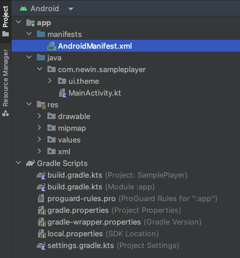

# AndroidManifest.xml 수정



## 퍼미션 추가

```xml
<manifest xmlns:android="....." >
    <uses-permission android:name="android.permission.INTERNET" />
    <uses-permission android:name="android.permission.READ_MEDIA_VIDEO" />
    <uses-permission android:name="android.permission.FOREGROUND_SERVICE" />
    <uses-permission android:name="android.permission.FOREGROUND_SERVICE_MEDIA_PLAYBACK" />
</manifest>
```

| 이름   | 설명 |
|-------|-----|
| android.permission.<br>INTERNET | 네트워크에서 데이터 통신을 가능하게 설정 |
| android.permission.<br>READ_MEDIA_VIDEO | 외부 저장소에서 비디오 파일을 열기 위한 설정<br>타겟 API 수준 33 이상에서 설정<br>타겟 API 수준 32 이하는 android.permission.READ_EXTERNAL_STORAGE를 사용 |
| android.permission.<br>FOREGROUND_SERVICE | 서비스를 포그라운드에서 사용하기 위해서 설정<br>타겟 API 수준 28 이상에서 설정 |
| android.permission.<br>FOREGROUND_SERVICE_MEDIA_PLAYBACK | 백그라운드에서  동영상을 계속 재생하기 위한 설정<br>타겟 API 수준 34 이상에서 설정 - 적절한 포그라운드 서비스 유형을 지정해야 합니다. |

## 미디어 및 플레이어 관련 설정 추가

```xml
<application>
    <activity
        android:name="com.newin.nplayer.sdk.MediaPlayerActivity"
        android:configChanges="orientation|screenSize|smallestScreenSize|screenLayout|keyboardHidden"
        android:exported="false"
        android:launchMode="singleTask"
        android:screenOrientation="sensor"
        android:supportsPictureInPicture="true"
        android:theme="@style/Theme.AppCompat"/>
    <service
        android:name="com.newin.nplayer.sdk.MediaPlaybackService"
        android:exported="false"
        android:foregroundServiceType="mediaPlayback">
        <intent-filter>
            <action android:name="androidx.media3.session.MediaSessionService" />        
        </intent-filter>
    </service>
</application>
```