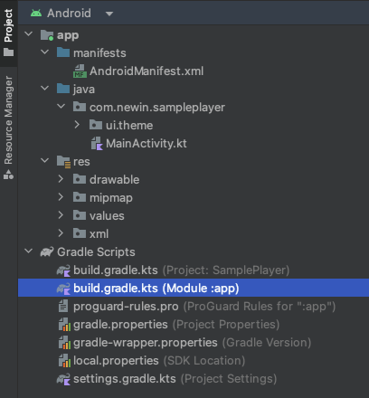
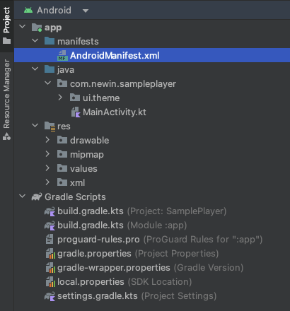

# 프로젝트 설정

## build.gradle.kts 수정



### 안드로이드 SDK 다운로드

[여기](http://app.playnplay.com/sdks/latest/NPlayerSDKSample-android.zip)에서 다운 받으세요.

### 안드로이드 SDK 추가

안드로이드 SDK가 포함된 디렉토리는 프로젝트 내 어디든 상관없습니다.

```kotlin
dependencies {
	implementation(files("libs/NPlayerSDK-release.aar"))
}
```

### 외부 라이브러리 의존성 추가

라이브러리 프로젝트 의존성은 안드로이드 SDK가 업데이트 됨에 따라 변동될 수 있습니다. 업데이트가 될 경우 해당 문서를 통해서 알려드리겠습니다.

```kotlin
dependencies {
	implementation("android.media 3:media3-ui:1.2.0")
	implementation("android.media 3:media3-session:1.2.0")
	implementation("androidx.media3:media3-exoplayer-smoothstreaming:1.2.0")
	implementation("android.navigation:navigation-fragment-ktx:2.7.6")
	implementation("android.navigation:navigation-compose:2.7.6")
	implementation("com.google.android.material:material:1.11.0")
	implementation("com.squareup.okhttp3:okhttp:4.11.0")

	coreLibraryDesugaring("com.android.tools:desugar_jdk_libs:2.0.4")
}
```

<div align="right">
참고: <a href="https://developer.android.com/studio/write/java8-support?hl=ko#library-desugaring">디슈가링 지원</a>
</div>

### 자바 버전

안드로이드 SDK에서 사용하는 자바 관련 버전은 아래와 같습니다.

```kotlin
android {
    compileOptions {
        isCoreLibraryDesugaringEnabled = true
		sourceCompatibility = JavaVersion.VERSION_1_8
        targetCompatibility = JavaVersion.VERSION_1_8
    }
    kotlinOptions {
 		jvmTarget = "1.8"
    }
}
```

## AndroidManifest.xml 수정



### 퍼미션 추가

```xml
<manifest xmlns:android="....." >
    <uses-permission android:name="android.permission.INTERNET" />
    <uses-permission android:name="android.permission.READ_MEDIA_VIDEO" />
    <uses-permission android:name="android.permission.FOREGROUND_SERVICE" />
    <uses-permission android:name="android.permission.FOREGROUND_SERVICE_MEDIA_PLAYBACK" />
</manifest>
```

| 이름   | 설명 |
|-------|-----|
| android.permission.<br>INTERNET | 네트워크에서 데이터 통신을 가능하게 설정 |
| android.permission.<br>READ_MEDIA_VIDEO | 외부 저장소에서 비디오 파일을 열기 위한 설정<br>타겟 API 수준 33 이상에서 설정<br>타겟 API 수준 32 이하는 android.permission.READ_EXTERNAL_STORAGE를 사용 |
| android.permission.<br>FOREGROUND_SERVICE | 서비스를 포그라운드에서 사용하기 위해서 설정<br>타겟 API 수준 28 이상에서 설정 |
| android.permission.<br>FOREGROUND_SERVICE_MEDIA_PLAYBACK | 백그라운드에서  동영상을 계속 재생하기 위한 설정<br>타겟 API 수준 34 이상에서 설정 - 적절한 포그라운드 서비스 유형을 지정해야 합니다. |

### 미디어 및 플레이어 관련 설정 추가

```xml
<application>
    <activity
        android:name="com.newin.nplayer.sdk.MediaPlayerActivity"
        android:configChanges="orientation|screenSize|smallestScreenSize|screenLayout|keyboardHidden"
        android:exported="false"
        android:launchMode="singleTask"
        android:screenOrientation="sensor"
        android:supportsPictureInPicture="true"
        android:theme="@style/Theme.AppCompat"/>
    <service
        android:name="com.newin.nplayer.sdk.MediaPlaybackService"
        android:exported="false"
        android:foregroundServiceType="mediaPlayback">
        <intent-filter>
            <action android:name="androidx.media3.session.MediaSessionService" />        
        </intent-filter>
    </service>
</application>
```