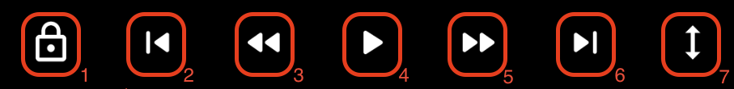

# 하단 인터페이스

## 1. 화면 잠금 버튼 
화면을 잠급니다. 화면을 길게 꾹 누르는 것과 동일합니다.
화면 잠금을 풀기 위해서는 화면 가운데 있는 자물쇠 해제 버튼을 클릭하면 됩니다.
 
## 2. 이전 버튼
6번의 다음 버튼과는 다르게, 목록에 이전 미디어가 없어도 활성화 됩니다. 현재 위치가 미디어의 처음 부분과 아주 가까울 경우에는 이전 미디어를 재생하고, 그렇지 않거나 이전 미디어가 없을 경우에는 현재 재생되는 미디어의 맨 앞으로 이동합니다.

## 3. 되감기 버튼
한 번 클릭할 경우, 재생 위치를 10초 전으로 이동합니다. 연속해서 클릭할 경우에는 재생할 위치를 계속하여 10초 전으로 업데이트합니다. 길게 꾹 누를 경우 이동할 위치를 계속해서 1초 전으로 업데이트합니다. 연속해서 클릭하거나 길게 꾹 누를 경우에는, 바로 이동하지는 않고, 사용자가 동작 혹은 입력을 멈출 경우 해당 위치로 이동합니다.

## 4. 재생/일시 정지 토글 버튼
미디어를 재생하거나 일시 정지할 수 있습니다.

## 5. 빨리 감기 버튼
한 번 클릭할 경우, 재생 위치를 10초 후로 이동합니다. 연속해서 클릭할 경우에는 재생할 위치를 계속하여 10초 후로 업데이트 합니다. 길게 꾹 누를 경우 이동할 위치를 계속해서 1초 후로 업데이트합니다. 연속해서 클릭하거나 길게 꾹 누를 경우에는, 바로 이동하지는 않고, 사용자가 동작 혹은 입력을 멈출 경우 해당 위치로 이동합니다.

## 6. 다음 버튼
목록에서 다음에 재생할 미디어가 있을 경우에만 활성화 됩니다. 이 버튼을 선택하면, 다음 미디어를 재생합니다.

## 7. 화면 크기 조절 버튼
총 다섯 종류의 화면을 제공합니다.

### RESIZE_MODE_FIT (기본)
화면비(aspect ratio)를 유지하며, 화면에 가려지는 것이 없이 미디어를 보여줄 수 있는 최대 크기

### RESIZE_MODE_FIXED_WIDTH
화면비를 유지하며, 화면 폭(width)에 딱 맞게 미디어 크기를 조절

### RESIZE_MODE_FIXED_HEIGHT
화면비를 유지하며, 화면 높이(height)에 딱 맞게 미디어 크기를 조절

### RESIZE_MODE_FILL
화면비를 무시하고, 화면에 빈 틈이 없이 가득 채울 수 있도록 미디어 크기를 조절

### RESIZE_MODE_ZOOM
화면비를 유지하며, 화면에 빈 틈이 없이 가득 채울 수 있도록 미디어 크기를 조절

