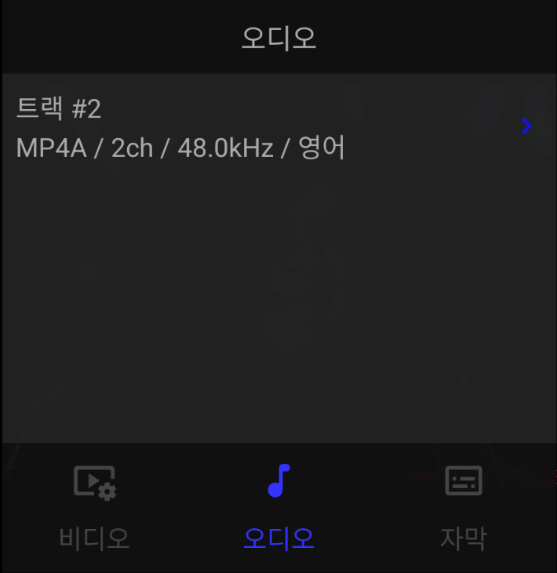
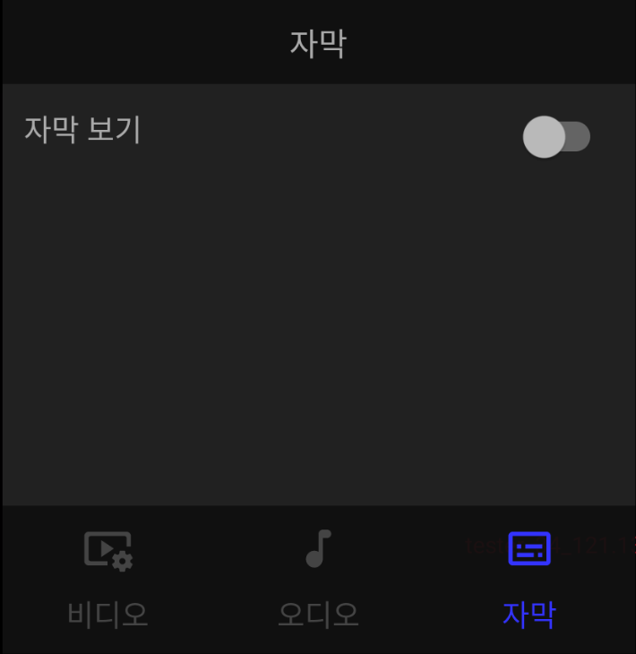

# 중앙 인터페이스

## 1.화면 회전 잠금 버튼 

화면 회전에 대한 플레이어의 기본 설정은 디바이스의 오리엔테이션에 맞춰서 화면이 회전하면서 크기가 변경되는 것입니다. 화면 회전 잠금 버튼을 활성화 시키면 디바이스가 어느 방향으로 회전해도 활성화 시켰을 당시의 화면 상태를 계속 유지합니다.

## 2. 구간 반복 버튼

구간 반복 버튼을 한 번 클릭하면, 구간 반복 모드로 들어갑니다. 반대로, 구간 반복 모드일 때 이 버튼을 다시 클릭하면 구간 반복 모드가 해제됩니다.

구간 반복 모드로 들어가면 화면 하단에 시작 위치와 종료 위치를 보여주는 버튼이 나타납니다. 위 그림처럼 버튼에 보이는 구간 사이를 반복하여 재생을 합니다.

버튼이 흰색일 경우는 각각 미디어의 맨 처음과 끝을 의미합니다. 버튼을 클릭하면 현재 위치를 업데이트 하며 구간 범위가 변경되고, 해당 버튼이 활성화된 색으로 변경 됩니다. 

방금 눌렀던(활성화 된) 버튼을 한 번 더 클릭하면, 현재 위치를 업데이트를 하는 것이 아니라 입력된 기존 위치를 초기화 하여, 맨 처음 또는 맨 끝으로 위치가 변경되고 버튼이 흰색으로 변경됩니다.

예를 들어, 사용자가 구간 반복 버튼을 눌러 구간 반복 모드로 진입 한 뒤, 1분 20초일 때, 시작 위치 버튼을 클릭하여 시작 위치를 1분 20초로 설정합니다. 그리고, 2분 10초로 이동하여, 종료 위치 버튼을 클릭하여, 종료 위치를 2분 10초로 설정합니다. 그러면, 미디어는 1:20~2:10 구간을 반복해서 계속 재생합니다. 다시 한 번 종료 위치 버튼을 클릭하면, 2분 10초가 사라지고, 해당 미디어의 전체 길이에 해당하는 위치가 버튼에 표시되고 버튼은 흰색으로 바뀝니다. 이제, 미디어 재생이 끝나면 1분 20초로 돌아가 다시 재생합니다.

## 3. 트랙 설정 버튼

### 1) 비디오 트랙 설정
현재 재생되는 비디오 트랙이 간단한 정보와 함께 화면에 표시됩니다.

비디오 트랙을 클릭하면, 비디오 트랙을 선택할 수 있는 화면이 나옵니다.

### 2) 오디오 트랙 설정
현재 재생되는 오디오 트랙이 간단한 정보와 함께 화면에 표시됩니다.

오디오 트랙을 클릭하면, 오디오 트랙을 선택할 수 있는 화면이 나옵니다.

### 3) 자막 트랙 설정	
현재 재생되는 미디어에 자막이 포함되어 있는 경우, 자막 보기 스위치 버튼을 사용하여, 자막을 끄고 켤 수 있습니다. 

자막 보기를 활성화 하면, 해당 미디어가 가지고 있는 모든 자막이 표시되며, 해당 자막을 클릭하여 자막 설정을 합니다.

\
\
\

## 4. 재생 속도 증가 버튼
재생 속도를 0.1배 만큼 증가 시킵니다.
버튼을 클릭하면 화면 중앙에 증가된 재생 속도를 보여줍니다. 최대 4.0배 까지 가능합니다.

## 5. 재생 속도 복구 버튼
현재 재생 속도를 보여줍니다.
버튼을 클릭하면 재생 속도를 정상속도로, 즉 1로 되돌립니다.

## 6. 재생 속도를 감소 버튼 
재생 속도를 0.1배 만큼 감소 시킵니다.
버튼을 클릭하면 화면 중앙에 감소된 재생 속도를 보여줍니다. 최소 0.1배 까지 가능합니다.
