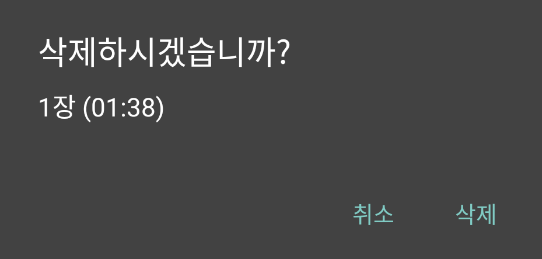

# 메뉴

## 재생 목록

현재 플레이어에 있는 재생 목록을 보여줍니다.

재생 목록에 있는 미디어 아이템을 선택하면, 재생 목록 화면은 닫지 않고, 해당 미디어 아이템을 재생합니다. 현재 재생되고 있는 아이템은 오른쪽 아이콘(✓)을 통해 확인할 수 있습니다.
완료 버튼을 클릭하면 재생 목록을 닫을 수 있습니다.

## 북마크

저장된 북마크 리스트를 보여줍니다.

우측 상단의 완료 버튼을 클릭하면 북마크 창을 닫을 수 있습니다.

좌측 상단의 플러스(+) 버튼을 클릭하여 현재 재생되고 있는 위치를 저장할 수 있습니다. 해당 버튼을 클릭하면, 북마크 제목을 넣을 수 있는 팝업창이 뜹니다. 확인을 클릭하여 현재 재생되는 위치를 북마크로 저장할 수 있습니다. 제목을 넣지 않아도, Untitled라는 이름의 북마크가 생성됩니다.

북마크 이름을 변경하려면 해당 아이템 행의 오른쪽에 있는 연필 버튼을 클릭하면 됩니다.

북마크를 삭제 하려면 해당 아이템 행의 맨 오른쪽의 휴지통 버튼을 클릭하면 됩니다.

## 화면 속 화면

화면 속 화면 모드를 활성화 하는 기능입니다. 상단 인터페이스의 화면 속 화면 버튼과 같은 기능입니다. 
화면 속 화면 모드로 진입하면 아래와 같이 미디어가 표시됩니다.

화면 속 화면에 싱글 클릭하면, 다음과 같은 컨트롤러 화면이 나타납니다. 해당 화면은 안드로이드 8.0이상에서 기본적으로 제공되는 화면입니다.

1. 설정 버튼
화면 속 화면 모드에 대한 설정을 수정합니다.

2. X 버튼
재생중인 미디어 플레이어를 종료합니다.

3. 화면 속 화면 모드 종료 버튼
화면 속 화면 모드를 종료합니다.

4. 이전 버튼
현재 위치가 미디어의 처음 부분과 매우 가까울 경우에는 이전 미디어를 재생하고, 그렇지 않거나 이전 미디어가 없을 경우에는 현재 재생되는 미디어의 맨 앞으로 이동합니다.

5. 재생 / 일시 정지 토글 버튼
미디어가 재생 중이면 일시 정지를 하고, 일시 정지 중이면 재생합니다.

6. 다음 버튼
다음 미디어로 이동합니다. 만약 현재 미디어가 목록의 마지막이면 비활성화 됩니다.
