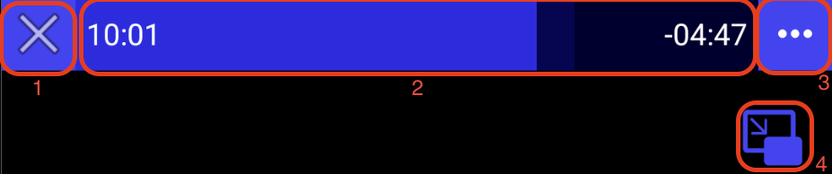
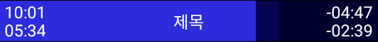

# 상단 인터페이스

## 1. 종료 버튼
미디어 플레이어를 종료합니다.

## 2. 타임바
사용자가 현재 재생 위치를 확인 하거나, 드래그나 클릭 등을 통해서 재생 위치를 변경할 수 있습니다. 

왼쪽에는 현재 재생되는 위치가 시:분:초로 표시되며, 오른쪽에는 남은 시간이 표시됩니다.

위의 예제 그림을 보면, 미디어는 지금 10분 1초 부분을 재생하고 있고, 앞으로 4분 47초 남아있음을 나타냅니다.

재생 속도가 1이 아닐 경우에는 재생 속도를 고려하여 계산된 현재 재생 위치와 남은 시간을 아래 부분에 추가적으로 표시합니다. 

아래의 그림은 재생 속도가 1.8배속일 때의 타임바를 보여줍니다.

## 3. 메뉴 버튼
[메뉴](../menu/home.md)를 엽니다.

## 4. 화면 속 화면 버튼

화면 속 화면 모드로 전환합니다. 안드로이드 8.0(API 수준 26)부터 사용 가능합니다. 보다 자세한 설명은 메뉴 내의 [화면 속 화면](../menu/home.md#화면-속-화면)을 참고하세요.
