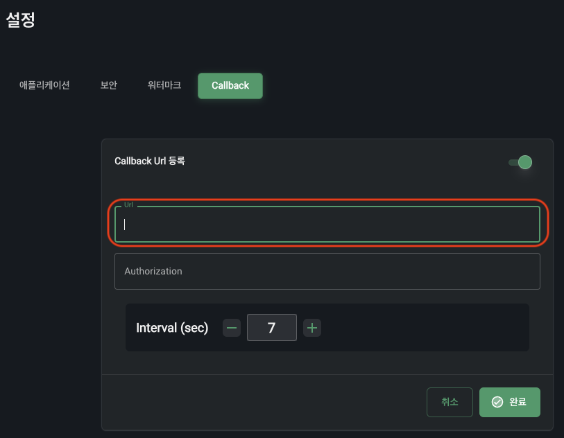
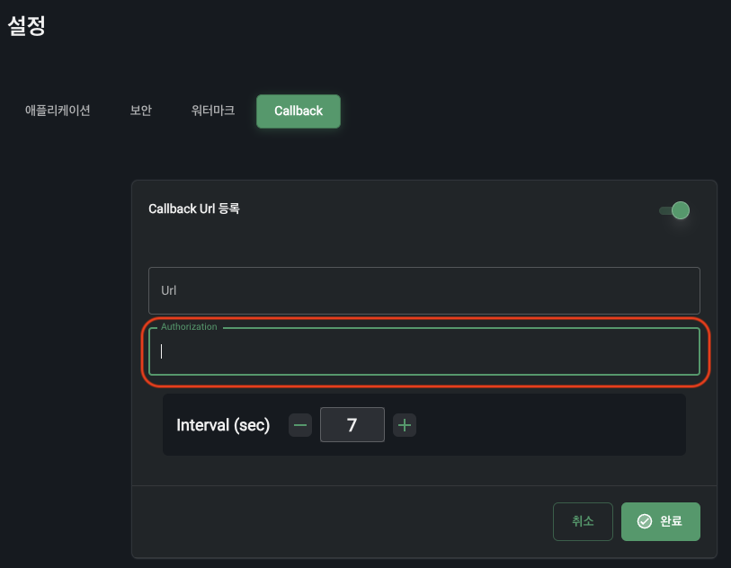
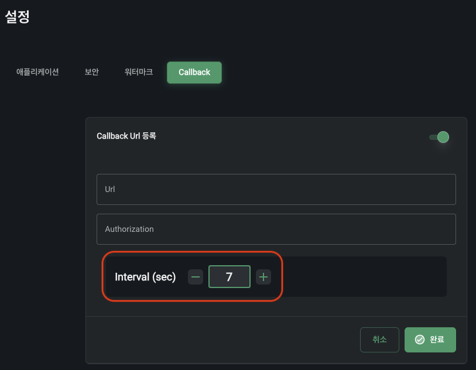

# Callback URL

## Callback URL 등록

미디어 재생 및 다운로드 제어 등을 위해 플레이어는 고객사가 콘솔 사이트에서 세팅한 Callback URL을 호출합니다. 이후 반환되는 응답에 따라 동작합니다.

## Authorization 등록

API 접근 권한을 위해 문자열 형태로 등록가능합니다. 선택사항입니다.

## Interval 설정

콘솔 사이트에 세팅된 interval에 맞춰 주기적으로 Callback URL에 [미디어 재생 진행 상태](./notifiy-playback-progress.md)를 전달합니다. 이를 통해 진도율 계산 등 필요한 데이터 활용이 가능합니다. 

## Callback URL에 전달하는 정보 

- [접근 권한 검사](./check-access-right.md)

- [재생 진행 상태 보고](./notifiy-playback-progress.md)

- [재생 상태 보고](./notifiy-playback-status.md)

- [재생 종료 보고](./notify-playback-finish.md)

- [다운로드 상태 보고](./notifiy-download-status.md)

- [북마크 데이터 업데이트](./update-bookmarks.md)
