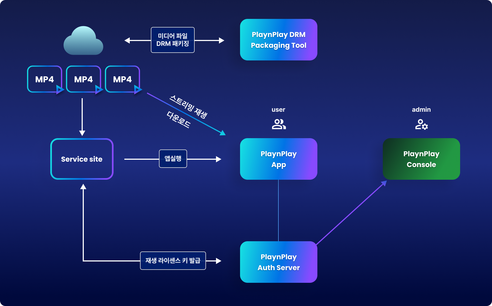
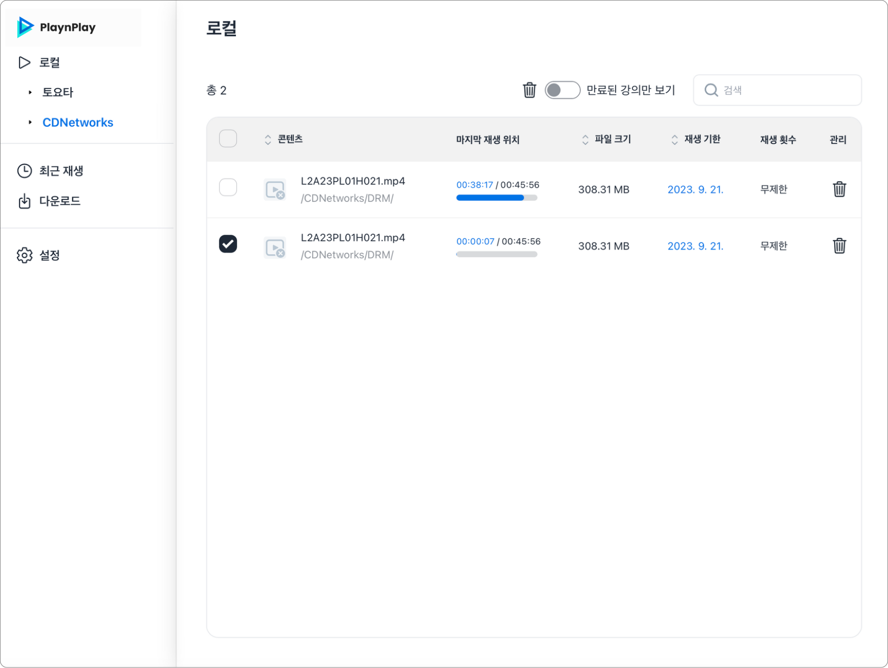
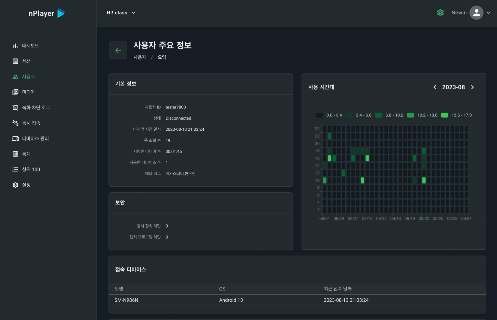

# 솔루션 소개 및 구성도

1. 솔루션 소개 및 구성도

    PlaynPlay는 미디어 서비스에 필요한 동영상 플레이어 부터 콘텐츠 보안, 통계, 분석 등 각종 기능들을 제공하는 토탈 미디어 솔루션입니다.
    

2. 구성 요소

    **PlaynPlay App**

    

    
    * PlaynPlay 앱은 스트리밍 재생, 배속, 구간 반복, 워터마크 등의 다양한 동영상 플레이어 기능, 화면 녹화 차단 및 방지 기능, DRM 콘텐츠를 다운로드 및 관리할 수 있는 기능들을 제공합니다.
    * 지원 OS : Windows 7 이상, macOS 10.13 이상, iOS 11 이상, Android 7.0 이상
    * iOS와 Android 버전은 앱스토어, 구글플레이를 통해 제공되며, Windows와 macOS 버전은 별도 설치 파일로 제공됩니다.

    **PlaynPlay Console**

    

    * PlaynPlay 콘솔 사이트는 PlaynPlay App과 연동하여, 사용자 및 세션 통계, 녹화 차단 관리, 디바이스 관리, 재생 통계, 보안 및 워터마크 관리 등 미디어 서비스에 필요한 다양한 기능들을 제공합니다.

    **PlaynPlay DRM packaging tool**

    * 미디어 콘텐츠 파일을 DRM 패키징하는 기능을 제공합니다.

    **PlaynPlay auth server** 

    * 미디어 파일 재생을 위한 라이센스 키를 발급하며, 세션을 관리합니다.
