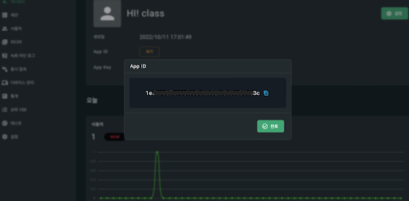
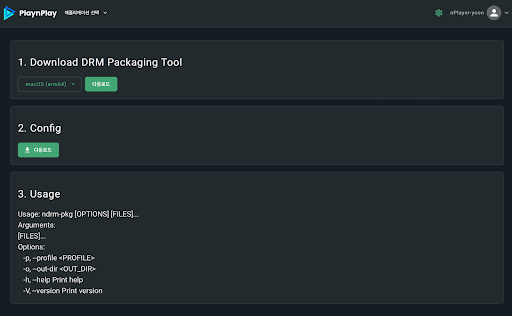
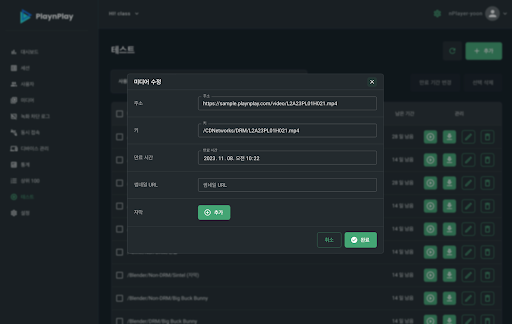

# 플로우

# 1. PlaynPlay Console 셋팅
* a. 발급 받은 계정으로 콘솔 사이트 로그인

* b. 서비스할 App 생성

* c. App Key, App ID 저장 → 미디어 재생을 위한 라이선스 키 발급 요청 시 이용
    
    

# 2. PlaynPlay DRM 패키징
* a. 콘솔 사이트에서 DRM 패키징 툴 다운로드

    

* b. 서비스할 미디어 파일들을 DRM 패키징하여 준비

# 3. 미디어 업로드
* a. DRM 패키징한 파일을 미디어 서버에 업로드

# 4. 재생 테스트
* a. 콘솔 사이트의 테스트 메뉴에서 업로드한 미디어 파일 주소 등을 입력해 재생 테스트

    
