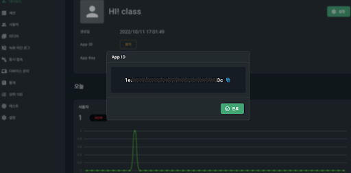
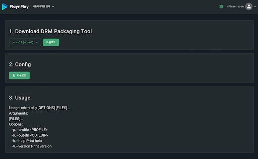
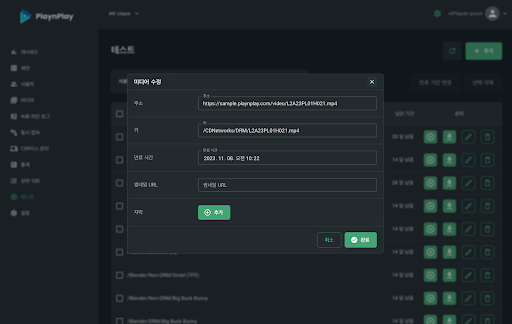

# 설정

다음과 같은 순서로 설정하시면 됩니다.

## 1. PlaynPlay Console 세팅

* 발급 받은 계정으로 콘솔 사이트에 로그인합니다.

* 서비스할 App을 생성합니다.

* App Key, App ID를 저장합니다. 이 값들은 미디어 재생을 위한 라이선스 키 발급 요청 시 사용됩니다.
    
    

## 2. PlaynPlay DRM 패키징

* 콘솔 사이트에서 DRM 패키징 툴을 다운로드합니다.

    

* 서비스할 미디어 파일들을 DRM 패키징하여 준비합니다. (Non DRM도 서비스 가능)

## 3. 미디어 업로드

* 발급 받은 계정으로 DRM 패키징한 파일을 미디어 서버(콘솔 사이트를 이용)에 업로드합니다.

<!-- ## 4. 재생 테스트

* 콘솔 사이트의 테스트 메뉴에서 업로드한 미디어 파일 주소 등을 입력하여 재생 테스트를 진행합니다.

     -->
