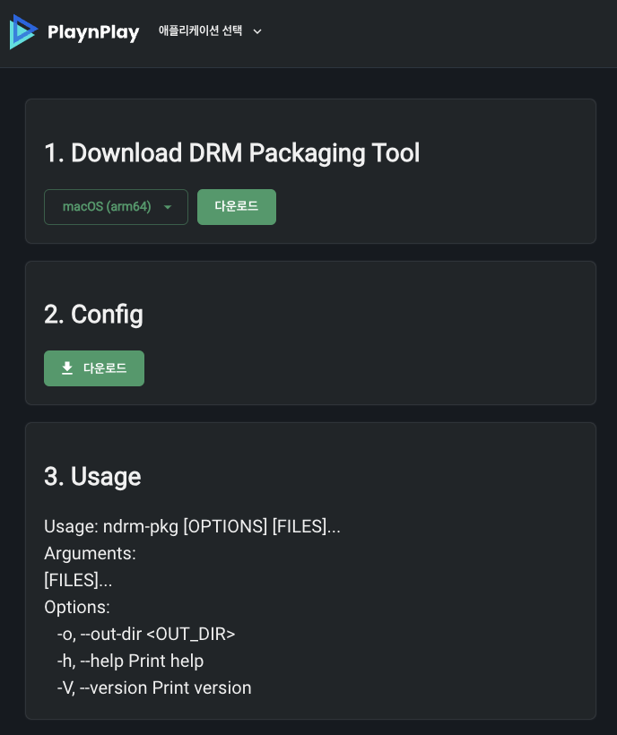

# DRM Packaging

DRM 패키징은 아래의 순서로 진행하시면 됩니다.

## 다운로드
콘솔 사이트에서 DRM 패키징 툴을 다운로드 합니다.<br>
이때, 다운로드한 ndrm-pkg 파일과 ndrmconfig 파일은 같은 디렉토리에 있어야 합니다.



<div align="right">
참고: <a href="../playnplay/settings/home.md#2-playnplay-drm-패키징">PlaynPlay DRM 패키징</a>
</div>

## 사용 방법

```shell
ndrm-pkg [옵션] [파일]
```

## 옵션

### -o, --out-dir <OUT_DIR>

이 옵션을 사용하면 <OUT_DIR> 디렉토리에 DRM 패키징된 파일들이 생성됩니다.<br>
이 옵션을 사용하지 않으면 해당 파일이 있는 디렉토리에 DRM 패키징된 파일들이 생성됩니다.

### 사용 예제
```shell
ndrm-pkg -o output video/*.mp4
```

### -h, --help

패키징 툴의 사용 방법을 볼 수 있습니다.

## 파일

\[파일\]에는 한 개 이상의 파일을 사용할 수 있고 파일과 파일 사이는 스페이스로 구분합니다. 또한, \[파일\]에 와일드카드를 사용할 수 있습니다.

|||
|:--:|:--:|
|/|디렉토리와 파일 사이에 사용|
|*|전체 파일을 대신하여 사용<br>*.mp4 형태로도 사용 가능|
|?|문자 하나를 대신하여 사용<br>??나 ??? 형태로도 사용 가능|
|**|하위 모든 경로에 대해 지정하고 싶을 때 사용<br>사용한 후에는 반드시 /\[파일\]이 필요|

### 사용 예제

```shell
ndrm-pkg data/2024/video.mp4

ndrm-pkg data/2023/video.mp4 data/2024/video.mp4

ndrm-pkg video/*

ndrm-pkg video/*.mp?

ndrm-pkg -o output **/video*.mp4

ndrm-pkg -o output data/**/*

ndrm-pkg -o output data/**/video*.mp4

ndrm-pkg -o output **/video0?.mp4 data/**/media??.mp4

ndrm-pkg -o output **/test*.?p?
```
