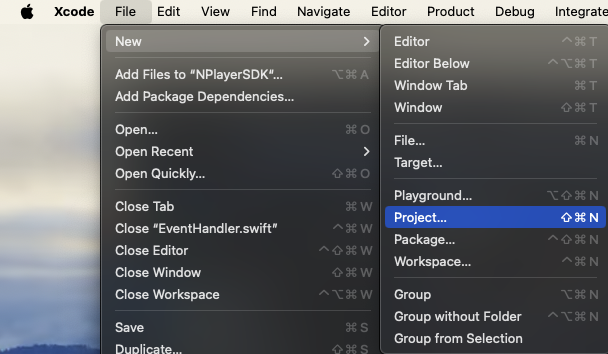
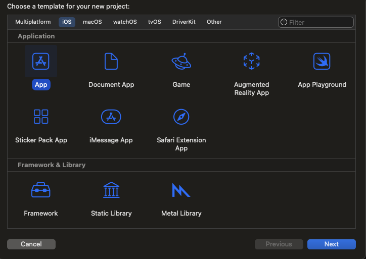
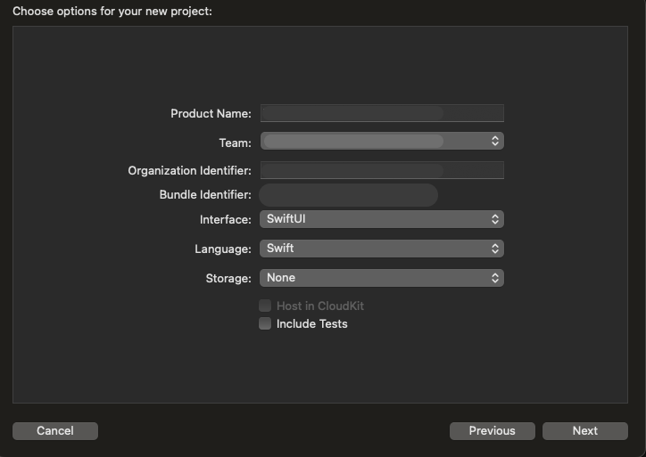
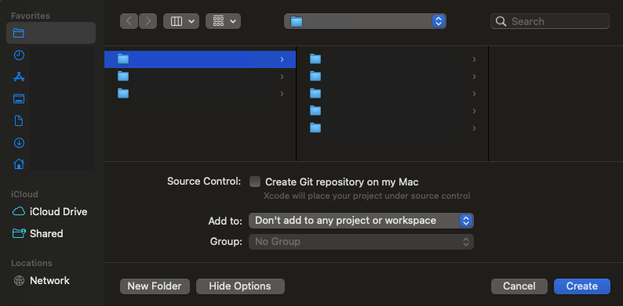

# 프로젝트 생성

## 빈 프로젝트 만들기

File > New > New Project 를 선택하여, 프로젝트를 생성합니다. (단축키: ⇧ ⌘ N)

## 템플릿 선택

사용하고자 하는 템플릿을 선택하고, **Next** 버튼을 선택하여 다음으로 진행합니다.

## 프로젝트 설정 및 생성

Product Name, Team, Organization Identifier, Build Identifier, Interface, Language, Storage를 설정하고, **Next** 버튼을 누르고 다음 화면으로 갑니다. 

그리고 저장할 디렉토리를 정하고, **Create** 버튼을 눌러서 프로젝트를 생성합니다.

