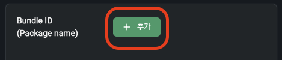
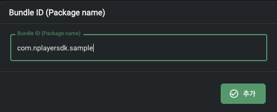
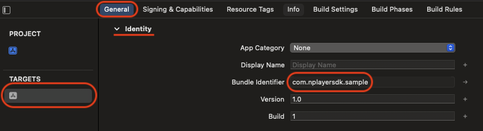
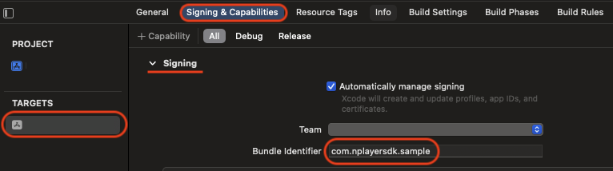
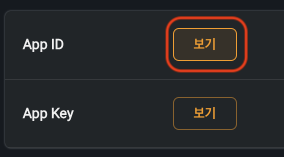

# 사용 방법

## 번들 아이디 추가

콘솔에 로그인하고 설정 > 애플리케이션으로 이동합니다.


아래 Bundle ID (Package name) 섹션에서 추가 버튼을 클릭합니다.



번들 아이디를 추가합니다.



번들 아이디는 Xcode의 설정 창에서 **TARGETS** 아래의 아이템을 선택한 후, **General** 탭 내의 **Identity** 섹션의 Bundle Identifier 에서 확인할 수 있습니다. 



혹은 **Signing & Capabilities** 탭 내의 **Signing** 섹션에서 확인 및 수정할 수 있습니다.



## AppDelegate 설정

미디어 재생 서비스를 설정하는 부분을 func application(_ application: UIApplication, didFinishLaunchingWithOptions launchOptions:  [UIApplication.LaunchOptionsKey: Any]?)에 추가합니다. 여기서 [오디오 세션](https://developer.apple.com/documentation/avfaudio/avaudiosession)을 구성하고, App 아이디를 사용하여 DRM 기본 설정을 합니다.

```swift
func application(
    _ application: UIApplication,
    didFinishLaunchingWithOptions launchOptions:
    [UIApplication.LaunchOptionsKey: Any]?
) -> Bool {
    MediaPlaybackService.initialize(appId: "xxxxxxxx-xxxx-xxxx-xxxx-xxxxxxxxxxx") // App 아이디

    return true
}
```

App 아이디는 콘솔에서 설정 > 애플리케이션 > App ID > 보기를 클릭하여 확인 가능합니다. 복사하여 붙여넣기를 하실 수 있습니다.




\
\

[다운로드 매니저](../class/download-manager/home.md)를 사용하기 위해서 func application(_ application: UIApplication, handleEventsForBackgroundURLSession identifier: String, completionHandler: @escaping () -> Void)에 백그라운드 처리를 위한 부분을 추가합니다.

```swift
func application(
    _ application: UIApplication,
    handleEventsForBackgroundURLSession identifier: String,
    completionHandler: @escaping () -> Void
) {
    DownloadManager.shared.setBackgroundCompletionHandler(
        sessionIdentifier: identifier,
        completionHandler: completionHandler
    )
}
```

\
\

## 뷰 컨트롤러 구성

### 하나의 미디어 열기

```swift
func openMedia() {
    // DRM 설정을 합니다.
    let drmConfiguration = DrmConfiguration
        .Builder(
            appId: "xxxxxxxx-xxxx-xxxx-xxxx-xxxxxxxxxxx",
            userId: "사용자 아이디"
        )
        .userData(userData) // 사용자 데이터(Callback URL에 전달한 데이터)
        .build()

    // 미디어 파일을 구성하며, DRM 설정을 합니다.
    let mediaItem = MediaItem.from(url: URL(string: "https://example.com/media.mp4")!)
        .buildUpon()
        .drmConfiguration(drmConfiguration)
        .build()
	
    // 미디어를 엽니다. 
    present([mediaItem], 0)
}
```

<div align="right">
참고: <a href="../class/drm-configuration-builder/home.md">DrmConfiguration.Builder</a>, 
<a href="../class/drm-configuration-builder/home.md#userdata_">userData</a>, 
<a href="https://developer.apple.com/documentation/foundation/url">URL</a>, 
<a href="../struct/media-item/home.md">MediaItem</a>, 
<a href="../class/uiviewcontroller/home.md#presentmediaitemsstartindexconfiguration">present(mediaItems:startIndex:configuration:)</a>
</div>

### 재생 목록으로 열기
iOS SDK에서 제공하는 present(mediaItems:startIndex:configuration:) 메서드를 사용하면, 쉽게 재생 목록을 열 수 있습니다.

```swift
let mediaItems: [MediaItem] = [ mediaItem1, mediaItem2, mediaItem3, ...]

present(mediaItems: mediaItems, startIndex: 0)
```

<div align="right">
참고: <a href="../class/uiviewcontroller/home.md#presentmediaitemsstartindexconfiguration">present(mediaItems:startIndex:configuration:)</a>
</div>

### 제목을 설정하는 예제

```swift
let mediaMetadata = MediaMetadata
    .Builder()
    .title("제목")
    .artworkUrl(URL(string:"https://www.example.com/image.jpg")!)
    .build()

let mediaItem = MediaItem
    .Builder(url: URL(string: "https://example.com/media.mp4")!)
    .mediaMetadata(mediaMetadata)
    .build()
```

<div align="right">
참고: <a href="../class/media-item-builder/home.md#mediametadata_">mediaMetadata()</a>, 
<a href="../class/media-item-builder/home.md">MediaItem.Builder</a>,
<a href="https://developer.apple.com/documentation/foundation/url">URL</a>
</div>

### 자막을 추가하는 예제

```swift
let subtitleConfigurations = [
    SubtitleConfiguration
        .Builder(url: URL(string: "https://example.com/subtitle.vtt")!)
        .language("언어")
        .label("라벨")
        .mode(.autoSelect)
        .build(),
    ...
]

let mediaItem = MediaItem
    .Builder(url: URL(string: "https://example.com/media.mp4")!)
    .subtitleConfigurations(subtitleConfigurations)
    .build()
```

<div align="right">
참고: <a href="../class/subtitle-configuration-builder/home.md">SubtitleConfiguration.Builder</a>, 
<a href="../struct/subtitle-configuration/home.md">SubtitleConfiguration.Mode</a>, 
<a href="../class/media-item-builder/home.md">MediaItem.Builder</a>, 
<a href="https://developer.apple.com/documentation/foundation/url">URL</a>
</div>


### Seek 기능 제한
미디어 아이템을 구성할 때, seekable(false)을 사용하여 Seek 기능을 제한할 수 있습니다.

```swift
let mediaItem = MediaItem.Builder(url: URL(string: "https://example.com/media.mp4")!)
    .seekable(false)
    .build()
```

<div align="right">
참고: <a href="../class/media-item-builder/home.md#seekable_">seekable(_)</a>
</div>
