# 프로젝트 설정

## iOS SDK 다운로드

[여기](https://app.playnplay.com/sdks/latest/NPlayerSDKSample-iOS.zip)에서 다운 받으세요.

## iOS SDK 추가

왼쪽 탭에서 방금 만든 프로젝트를 클릭하면 오른쪽에 아래 그림과 같은 설정 창이 열립니다. **PROJECT** 아래의 아이템이 선택되어 있으면, 여기에서 iOS Deployment Target 등 원하는 설정을 해주시면 됩니다.

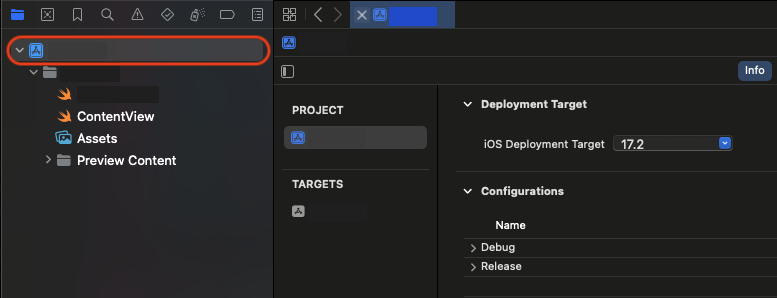

**TARGETS** 아래에 있는 아이템을 선택하시면, 아래 그림처럼 세부사항이 나타납니다. 프로젝트를 처음 만들어서 화면이 열렸을 경우에는 **TARGETS** 아래 아이템이 이미 선택되어 있을 수도 있습니다.

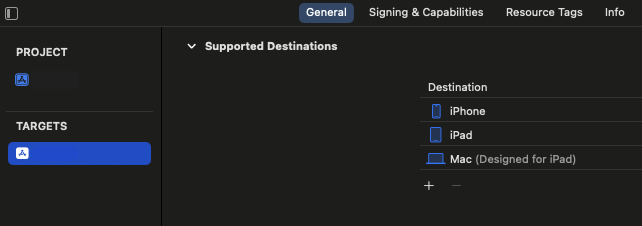

**General** 탭을 선택한 뒤, 아래로 쭉 내리면 **Frameworks, Libraries, and 
Embedded Content** 섹션이 있습니다. SDK를 추가하기 위해서 **+** 버튼을 누릅니다.

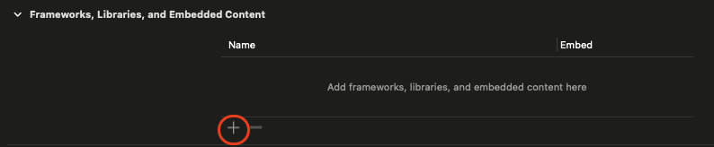

프레임워크와 라이브러리를 선택하는 팝업에서 Add Files를 선택합니다.

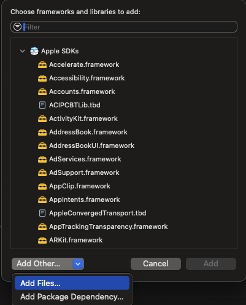

**Open** 버튼을 클릭하여 제공받은 NPlayerSDK를 추가합니다.

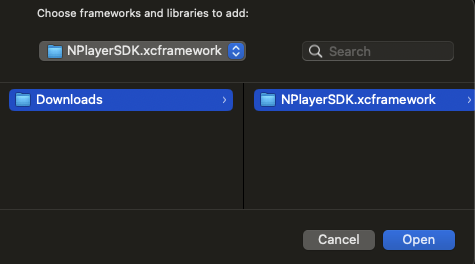

다음과 같이 추가가 된 것을 확인합니다.

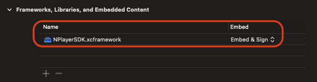

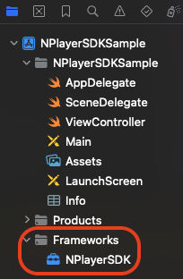

이제 swift 파일에서 import NPlayerSDK를 입력하여 SDK를 사용할 수 있습니다. 

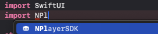

    

--------
## Capability 추가

**General**의 오른쪽에 있는 **Signing & Capabilities** 탭을 클릭합니다. 그리고 **+ Capability** 를 클릭합니다.

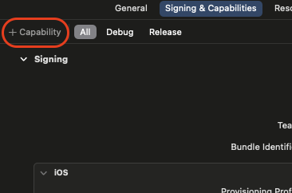

현재 추가되어 있지 않은 **Capability** 목록이 화면에 나타납니다.

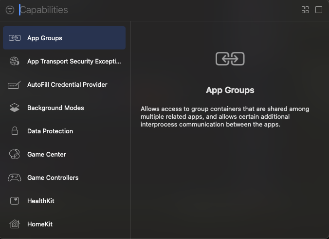

커서 있는 곳에서 **Background Modes**를 직접 입력하여 검색을 하거나 아래 목록에서 **Background Modes**를 찾아서, 더블 클릭을 하시면 해당 모드가 추가 됩니다.

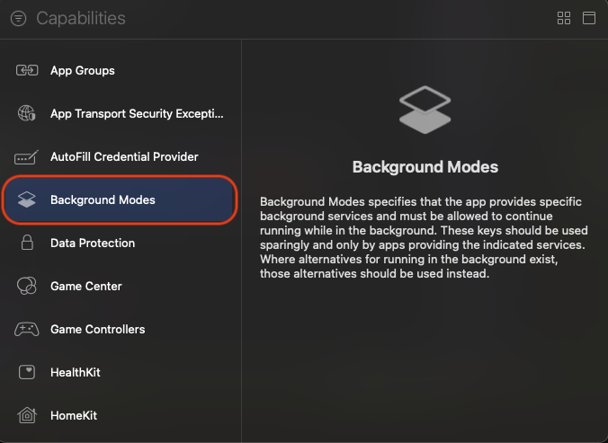
              
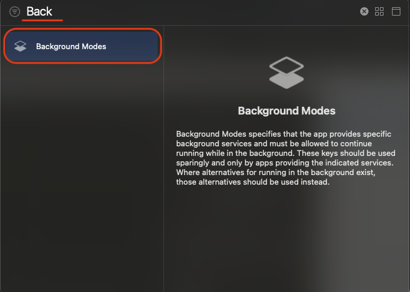

추가한 **Background Modes**에서 **Audio, AirPlay, and Pictures in Picture**를 활성화합니다.

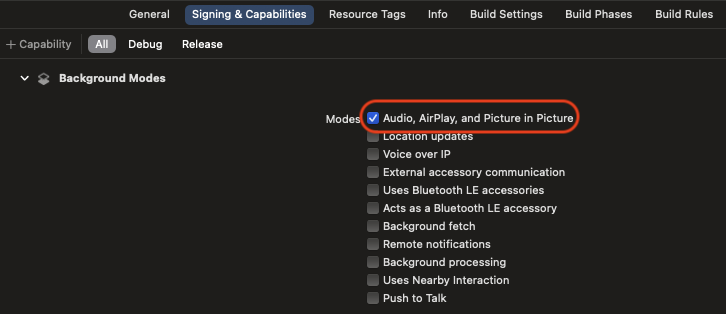

    

--------
## Destination 선택

다시 프로젝트로 돌아간 후, Run destination을 선택합니다. My Mac을 선택하면, 실 디바이스 없이 테스트 및 디버깅을 할 수 있습니다.

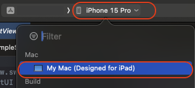
