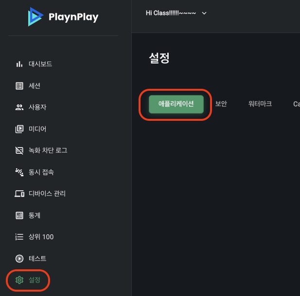

# 사용 방법

## 번들 아이디 추가

콘솔에 로그인하고 설정 > 애플리케이션으로 이동합니다.



아래 Bundle ID (Package name) 섹션에서 추가 버튼을 클릭합니다.


번들 아이디를 추가합니다.


번들 아이디는 Xcode의 설정 창에서 **TARGETS** 아래의 아이템을 선택한 후, **General** 탭 내의 **Identity** 섹션의 Bundle Identifier 에서 확인할 수 있습니다. 


혹은 **Signing & Capabilities** 탭 내의 **Signing** 섹션에서 확인 및 수정할 수 있습니다.


## AppDelegate 설정

미디어 재생 서비스를 설정하는 부분을 func application(_ application: UIApplication, didFinishLaunchingWithOptions launchOptions:  [UIApplication.LaunchOptionsKey: Any]?)에 추가합니다. 여기서 [오디오 세션](https://developer.apple.com/documentation/avfaudio/avaudiosession)을 구성하고, App 아이디를 사용하여 DRM 기본 설정을 합니다.

```swift
func application(
    _ application: UIApplication,
    didFinishLaunchingWithOptions launchOptions:
    [UIApplication.LaunchOptionsKey: Any]?
) -> Bool {
    MediaPlaybackService.initialize(appId: "xxxxxxxx-xxxx-xxxx-xxxx-xxxxxxxxxxx") // App 아이디

    return true
}
```

App 아이디는 콘솔에서 설정 > 애플리케이션 > App ID > 보기를 클릭하여 확인 가능합니다. 복사하여 붙여넣기를 하실 수 있습니다.


\
\

[다운로드 매니저](../class/download-manager/home.md)를 사용하기 위해서 func application(_ application: UIApplication, handleEventsForBackgroundURLSession identifier: String, completionHandler: @escaping () -> Void)에 백그라운드 처리를 위한 부분을 추가합니다.

```swift
func application(
    _ application: UIApplication,
    handleEventsForBackgroundURLSession identifier: String,
    completionHandler: @escaping () -> Void
) {
    DownloadManager.shared.setBackgroundCompletionHandler(
        sessionIdentifier: identifier,
        completionHandler: completionHandler
    )
}
```

\
\

## 뷰 컨트롤러 구성

### 하나의 미디어 열기

```swift
func openTestMedia() {
    // DRM 설정을 합니다.
    let drmConfiguration = DrmConfiguration.Builder(
        appId: "xxxxxxxx-xxxx-xxxx-xxxx-xxxxxxxxxxx",
        userId: "사용자 아이디"
    ).build()

    // 미디어 파일을 구성하며, DRM 설정을 합니다.
    let mediaItem = MediaItem.from(url: URL(string: "미디어주소.mp4")!)
        .buildUpon()
        .drmConfiguration(drmConfiguration)
        .build()
	
    // 미디어를 엽니다. 
    let playerViewController = MediaPlayerViewController.new() // 뷰컨트롤러를 만듭니다.
    self.present(playerViewController, animated: animated) {
        playerViewController.player.load(
            mediaItem: mediaItem
        )
    }
}
```

<div align="right">
관련 코드 설명: <a href="../class/drm-configuration-builder/home.md">DrmConfiguration.Builder</a>,<br>
<a href="../struct/media-item/home.md">MediaItem</a>,<br>
<a href="#uiviewcontrollerpresent_animatedcompletion">self.present(_:animated:completion:)</a>,<br>
<a href="../class/media-player/details.md#loadmediaitem">playerViewcontroller.player.load(mediaItem:)</a>
</div>

### 재생 목록으로 열기
iOS SDK에서 제공하는 present(mediaItems:startIndex:) 메서드를 사용하면, 쉽게 재생 목록을 열 수 있습니다.

```swift
let mediaItems: [MediaItem] = [ mediaItem1, mediaItem2, mediaItem3, ...]

self.present(mediaItems: mediaItems, startIndex: 0)
```

<div align="right">
관련 코드 설명: <a href="#presentmediaitemsstartindex">present(mediaItems:startIndex:)</a>
</div>

### 제목 설정
빌드하기 전에 제목을 설정할 수 있습니다.

```swift
let mediaItem = MediaItem.Builder(url: URL(string: "미디어주소.mp4")!)
    .mediaMetadata(
        MediaMetadata.Builder().title("제목").build()
    )
    .build()
```

<div align="right">
참고: <a href="../class/media-item-builder/details.md#mediametadata_">mediaMetadata()</a>
</div>

### Seek 기능 제한
미디어 아이템을 구성할 때, seekable(false)을 사용하여 Seek 기능을 제한할 수 있습니다.

```swift
let mediaItem = MediaItem.Builder(url: URL(string: "미디어주소.mp4")!)
    .seekable(false)
    .build()
```

<div align="right">
참고: <a href="../class/media-item-builder/details.md#seekable_">seekable(_)</a>
</div>

## 구성 관련 코드 추가 설명

### present(mediaItems:startIndex:)
```swift
extension UIViewController {
    public func present(mediaItems: [MediaItem], startIndex: Int = 0)
}
```
|파라미터|타입|설명|
|:--:|:--:|--|
|mediaItems|\[[MediaItem]\]|미디어 아이템 목록|
|startIndex|Int|재생할 미디어의 인덱스|

위 [재생 목록 열기](#재생-목록으로-열기)에서 사용한 present(mediaItems:startIndex:)는 아래와 같이 구현되어 있으니 참고하여 확장해서 사용하십시오.

```swift
public func present(mediaItems: [MediaItem], startIndex: Int = 0) {
    if case .some(let playerViewController) = 
        self.presentedViewController as? MediaPlayerViewController {
            playerViewController.player.load(
                mediaItems: mediaItems,
                startMediaItemIndex: startIndex
            )
            return
        }

    let playerViewController = MediaPlayerViewController.new()

    self.present(playerViewController, animated: true) {
        let player = playerViewController.player
        player.addEventHandler(
            .ended({ [weak self] in
                self?.dismiss(animated: true) })
            )
        player.addEventHandler(
            .error({ [weak playerViewController] error in
                let alert = UIAlertController(
                    title: nil,
                    message: error.localizedDescription,
                    preferredStyle: .alert
                )
                alert.addAction(
                    UIAlertAction.init(
                        title: "Close",
                        style: .default
                    ) { [weak self] _ in
                        self?.dismiss(animated: true)
                    }
                )
                playerViewController?.present(alert, animated: true)
            })
        )
        player.load(
            mediaItems: mediaItems,
            startMediaItemIndex: startIndex
        )
    }
}
```

### present(_:animated:completion:)
```swift
class UIViewController {
    func present(
        _ viewControllerToPresent: UIViewController,
        animated flag: Bool,
        completion: (() -> Void)? = nil
    )
}
```
|파라미터|타입|설명|
|:--:|:--:|--|
|viewControllerToPresent|UIViewController|화면에 보여줄 뷰컨트롤러입니다.|
|flag|Bool|화면에 보일 때, 애니메이션을 추가할 지 여부입니다.|
|completion|(() -> Void)?|뷰컨트롤러가 화면에 보인 후 실행할 블록입니다. 위의 예제에서는 미디어를 읽어옵니다.|

화면에 뷰컨트롤러를 표시합니다. [재생 목록 열기](#재생-목록으로-열기)에서 사용한 [present(mediaItems:startIndex:)](#presentmediaitemsstartindex)를 활용하시면 좋습니다.

<div align="right">
참고: <a href="https://developer.apple.com/documentation/uikit/uiviewcontroller/1621380-present">present(_:animated:completion:)</a>
</div>
