# 상단 인터페이스

## 1. 종료 버튼
미디어 플레이어를 종료합니다.

## 2. 타임바
사용자가 현재 재생 위치를 확인 하거나, 드래그나 클릭 등을 통해서 재생 위치를 변경할 수 있습니다. 

왼쪽에는 현재 재생되는 위치가 시:분:초로 표시되며, 오른쪽에는 남은 시간이 표시됩니다.

위의 예제 그림을 보면, 미디어는 지금 5분 21초 부분을 재생하고 있고, 앞으로 9분 26초 남아있음을 나타냅니다.

재생 속도가 1이 아닐 경우에는 재생 속도를 고려하여 계산된 현재 재생 위치와 남은 시간을 아래 부분에 추가적으로 표시합니다. 

아래의 그림은 재생 속도가 1.8배속일 때의 타임바를 보여줍니다.

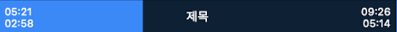

## 3. 메뉴 버튼
[메뉴](#메뉴)를 엽니다.

## 4. 화면 속 화면 버튼

화면 속 화면 모드로 전환합니다. 보다 자세한 설명은 [화면 속 화면](#화면-속-화면)을 참고하세요.

--------
# 메뉴

## 1. 재생목록
현재 플레이어에 있는 재생 목록을 보여줍니다.

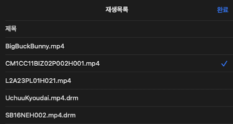

재생 목록에 있는 미디어 아이템을 선택하면, 재생 목록 화면이 닫히며, 해당 미디어 아이템을 재생합니다. 현재 재생되고 있는 아이템은 오른쪽 아이콘(✓)을 통해 확인할 수 있습니다. 완료 버튼을 클릭하면 재생 목록을 닫을 수 있습니다.

## 2. 북마크
저장된 북마크 리스트를 보여줍니다.

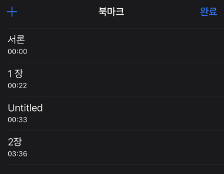

우측 상단의 완료 버튼을 클릭하면 북마크 창을 닫을 수 있습니다.
좌측 상단의 플러스(+) 버튼을 클릭하여 현재 재생되고 있는 위치를 저장할 수 있습니다. 해당 버튼을 클릭하면, 북마크 제목을 넣을 수 있는 팝업창이 뜹니다. 확인을 클릭하여 현재 재생되는 위치를 북마크로 저장할 수 있습니다. 제목을 넣지 않아도, Untitled라는 이름의 북마크가 생성됩니다. 

북마크 이름을 수정하거나 삭제하려면, 해당 북마크를 꾹 누른 채로 왼쪽으로 스와이프하면 됩니다.

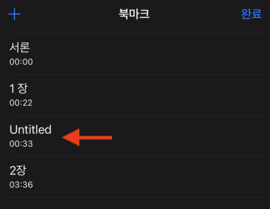

왼쪽 방향으로 약간 스와이프하면 아래 그림처럼 편집, 삭제 버튼이 나타납니다.

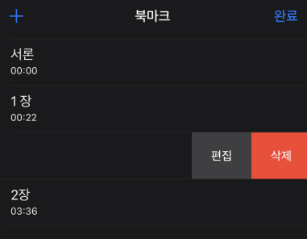 

북마크 이름을 변경하려면 편집 버튼을 클릭하면 됩니다.
 
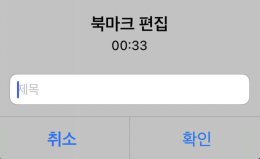

북마크를 삭제 하려면 삭제 버튼을 클릭하면 됩니다. 혹은 왼쪽 방향으로 끝까지 스와이프를 하게 되면, 클릭할 필요없이 바로 삭제 확인 팝업이 뜨게 됩니다.
 
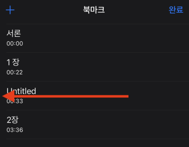

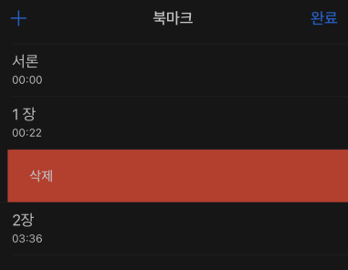

## 3. 화면 속 화면
화면 속 화면 모드를 활성화 하는 기능입니다. 상단 인터페이스의 화면 속 화면 버튼과 같은 기능입니다. 
화면 속 화면 모드로 진입하면 아래와 같이 미디어가 표시됩니다.

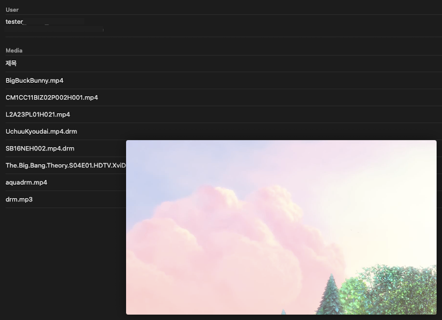

화면 속 화면에 싱글 클릭하면, 다음과 같은 컨트롤러 화면이 나타납니다.

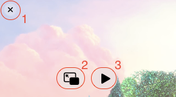

### 1. X 버튼,  2. 화면 속 화면 모드 종료 버튼
화면 속 화면 모드를 종료합니다.

### 3. 재생 / 일시 정지 토글 버튼
미디어가 재생 중이면 일시 정지를 하고, 일시 정지 중이면 재생합니다.

    

--------
# 중앙 인터페이스

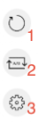

## 1. 화면 회전 잠금 버튼
화면 회전에 대한 플레이어의 기본 설정은 디바이스의 오리엔테이션에 맞춰서 화면이 회전하면서 크기가 변경되는 것입니다. 화면 회전 잠금 버튼을 활성화 시키면 디바이스가 어느 방향으로 회전해도 활성화 시켰을 당시의 화면 상태를 계속 유지합니다.

## 2. 구간 반복 버튼
구간 반복 버튼을 한 번 클릭하면, 구간 반복 모드로 들어갑니다. 반대로, 구간 반복 모드일 때 이 버튼을 다시 클릭하면 구간 반복 모드가 해제됩니다.

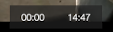

구간 반복 모드로 들어가면 화면 하단에 시작 위치와 종료 위치를 보여주는 버튼이 나타납니다. 위 그림처럼 버튼에 보이는 구간 사이를 반복하여 재생을 합니다.

버튼이 기본색일 경우는 각각 미디어의 맨 처음과 끝을 의미합니다. 버튼이 기본색일 경우, 버튼을 클릭하면 현재 위치를 업데이트 하며 구간 범위가 변경되고, 해당 버튼이 활성화된 색으로 변경 됩니다. 

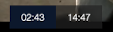

위처럼 위치를 업데이트 했던(활성화 된) 버튼을 한 번 더 클릭하면, 현재 위치를 업데이트를 하는 것이 아니라 버튼에 표시된 위치를 초기화합니다. 구간 시작 위치일 경우에는 맨 처음으로 구간 종료 위치일 경우에는 맨 끝으로 위치가 변경되고 버튼이 기본색으로 변경됩니다.

예를 들어, 사용자가 구간 반복 버튼을 눌러 구간 반복 모드로 진입 한 뒤, 1분 20초일 때, 시작 위치 버튼을 클릭하여 시작 위치를 1분 20초로 설정합니다. 그리고 2분 10초로 이동하여, 종료 위치 버튼을 클릭하여, 종료 위치를 2분 10초로 설정합니다. 그러면 미디어는 1:20~2:10 구간을 반복해서 계속 재생합니다.
다시 한 번 종료 위치 버튼을 클릭하면, 2분 10초가 사라지고, 해당 미디어의 전체 길이에 해당하는 위치가 버튼에 표시되고 버튼은 기본색으로 바뀝니다. 이제는 미디어 재생이 끝나면 1분 20초로 돌아가 다시 재생합니다.

## 3. 트랙 설정 버튼

### 1) 비디오 트랙 설정
현재 재생되는 비디오 트랙이 간단한 정보와 함께 화면에 표시됩니다.

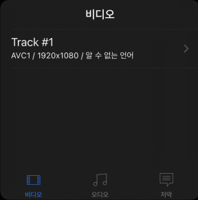

비디오 트랙을 클릭하면, 비디오 트랙을 선택할 수 있는 화면이 나옵니다.

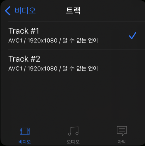

### 2) 오디오 트랙 설정
현재 재생되는 오디오 트랙이 간단한 정보와 함께 화면에 표시됩니다.

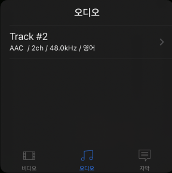

오디오 트랙을 클릭하면, 오디오 트랙을 선택할 수 있는 화면이 나옵니다.

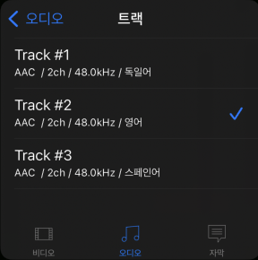

### 3) 자막 트랙 설정	
현재 재생되는 미디어에 자막이 포함되어 있는 경우, 자막 보기 스위치 버튼을 사용하여, 자막을 끄고 켤 수 있습니다.

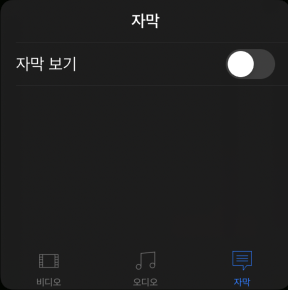

자막 보기를 활성화 하면, 해당 미디어가 가지고 있는 모든 자막이 표시되며, 해당 자막을 클릭하여 자막 설정을 합니다.

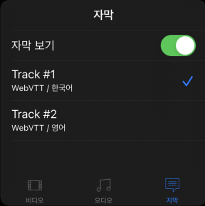

\
\
\

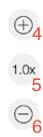

## 4. 재생 속도 증가 버튼
재생 속도를 0.1배 만큼 증가 시킵니다.
버튼을 클릭하면 화면 중앙에 증가된 재생 속도를 보여줍니다. 최대 4.0배 까지 가능합니다.

## 5. 재생 속도 복구 버튼
현재 재생 속도를 보여줍니다.
버튼을 클릭하면 재생 속도를 정상속도로, 즉 1로 되돌립니다.

## 6. 재생 속도를 감소 버튼 
재생 속도를 0.1배 만큼 감소 시킵니다.
버튼을 클릭하면 화면 중앙에 감소된 재생 속도를 보여줍니다. 최소 0.1배 까지 가능합니다.

    

--------
# 하단 인터페이스

## 1. 화면 잠금 버튼 
화면을 잠급니다. 화면을 길게 꾹 누르는 것과 동일합니다.
화면 잠금을 풀기 위해서는 화면 가운데 있는 자물쇠 해제 버튼을 클릭하면 됩니다.
 
## 2. 이전 버튼
6번의 다음 버튼과는 다르게, 목록에 이전 미디어가 없어도 활성화 됩니다. 현재 위치가 [maxSeekToPreviousPosition](../../class/media-player/home.md#maxseektopreviousposition) 보다 전이면 이전 미디어를 재생하고, 그렇지 않거나 이전 미디어가 없을 경우에는 현재 재생되는 미디어의 맨 앞으로 이동합니다.

## 3. 되감기 버튼
한 번 클릭할 경우, 재생 위치를 [seekBackIncrement](../../class/media-player/home.md#seekbackincrement)(기본값: 10초) 전으로 이동합니다. 연속해서 클릭할 경우에는 재생할 위치를 계속하여 [seekBackIncrement](../../class/media-player/home.md#seekbackincrement) 전으로 업데이트합니다. 길게 꾹 누를 경우 이동할 위치를 계속해서 1초 전으로 업데이트합니다. 연속해서 클릭하거나 길게 꾹 누를 경우에는, 바로 이동하지는 않고, 사용자가 동작 혹은 입력을 멈출 경우 해당 위치로 이동합니다.

## 4. 재생/일시 정지 토글 버튼
미디어를 재생하거나 일시 정지할 수 있습니다.

## 5. 빨리 감기 버튼
한 번 클릭할 경우, 재생 위치를 [seekForwardIncrement](../../class/media-player/home.md#seekforwardincrement)(기본값: 10초) 후로 이동합니다. 연속해서 클릭할 경우에는 재생할 위치를 계속하여 [seekForwardIncrement](../../class/media-player/home.md#seekforwardincrement) 후로 업데이트 합니다. 길게 꾹 누를 경우 이동할 위치를 계속해서 1초 후로 업데이트합니다. 연속해서 클릭하거나 길게 꾹 누를 경우에는, 바로 이동하지는 않고, 사용자가 동작 혹은 입력을 멈출 경우 해당 위치로 이동합니다.

## 6. 다음 버튼
목록에서 다음에 재생할 미디어가 있을 경우에만 활성화 됩니다. 이 버튼을 선택하면, 다음 미디어를 재생합니다.

## 7. 화면 크기 조절 버튼
세 종류의 화면 크기를 제공합니다.

<a href="../../enum/media-player-scaling-mode/home.md">참고: ScalingMode</a>

### Scaling.aspectFit (기본)
화면비를 유지하며, 화면에 가려지는 것이 없이 미디어를 보여줄 수 있는 최대 크기로 화면 전환

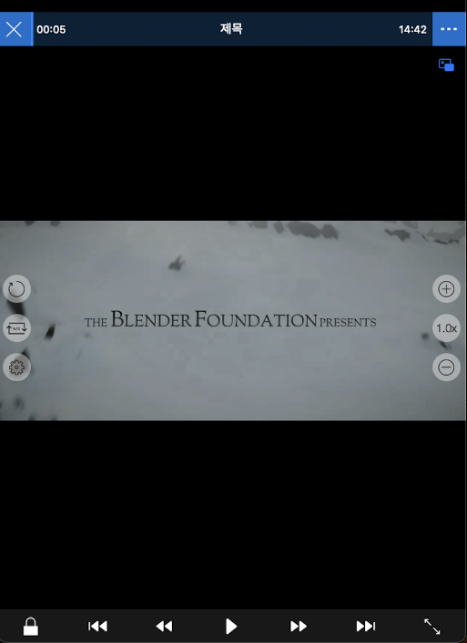

### Scaling.aspectFill
화면비를 유지하며, 화면에 빈 틈이 없이 가득 채울 수 있도록 미디어 크기로 화면 전환

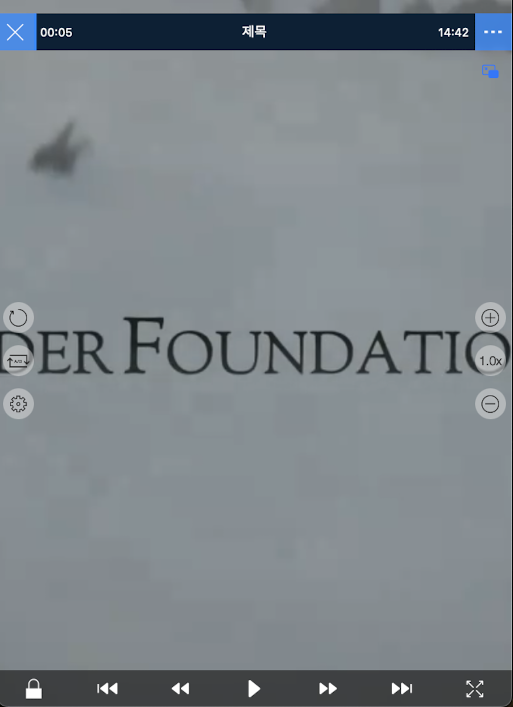

### Scaling.fill
화면비를 무시하고, 화면에 빈 틈이 없이 가득 채울 수 있도록 미디어 크기로 화면 전환

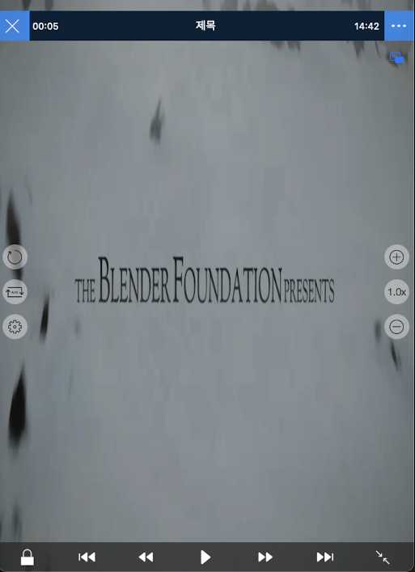
