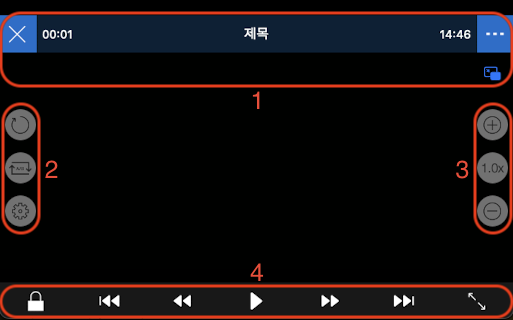

# 화면 구성

1.  화면 상단에 타임바를 중심으로하여, 왼쪽에 종료 버튼과 오른쪽에 메뉴 버튼이 있습니다. 우측에 화면 속 화면 버튼이 있습니다.
2. 화면 중앙의 왼쪽에는 화면 회전 잠금, 구간 반복, 트랙 설정 버튼이 있습니다.
3. 화면 중앙의 오른쪽에는 재생 속도와 관련된 버튼들이 있습니다.
4. 화면 하단에는 화면 잠금 버튼과 미디어 네비게이션 버튼, 화면 크기 조절 버튼이 있습니다.

화면 구성에 대한 더 자세한 설명은 아래를 참고하십시오.

- [상단 인터페이스](./details.md#상단-인터페이스)

- [메뉴](./details.md#메뉴)

- [중앙 인터페이스](./details.md#중앙-인터페이스)

- [하단 인터페이스](./details.md#하단-인터페이스)
